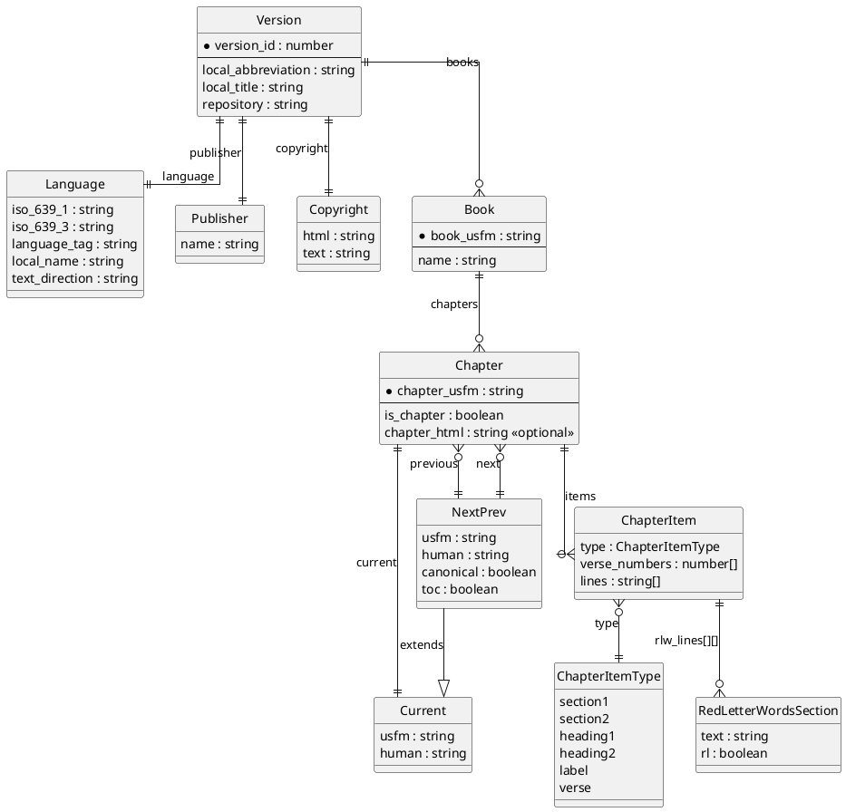

# Estado actual de arquitectura

## Alcance

`reading-json-files` es una utilidad de consola escrita en TypeScript para leer archivos JSON con contenido bíblico, transformar capítulos seleccionados y generar un `README.md` en formato Markdown.

El proyecto no expone una API HTTP, no tiene una capa de persistencia propia y no mantiene estado de aplicación entre ejecuciones. Su arquitectura actual es un flujo batch local: obtiene datos JSON, los recorre en memoria y escribe un documento Markdown como salida.

## Vista de componentes

```text
package.json
  scripts
    start -> tsx ./src/index.ts
    types -> tsc

src/index.ts
  entrada: URLs JSON remotas definidas en CHAPTERS_TO_PRINT
  proceso: selección de versión, libro, capítulo e items
  salida: README.md generado

src/types.ts
  contrato estructural del JSON de versiones bíblicas

content/NVI_vid_128.json
  ejemplo local de fuente JSON completa

architecture/entity_relations.puml
  modelo entidad-relación del dominio JSON
```

## Flujo de ejecución

1. El comando `yarn start` o `npm run start` ejecuta `tsx ./src/index.ts`.
2. `src/index.ts` construye la ruta de salida `README.md` desde el directorio del módulo actual.
3. La constante `CHAPTERS_TO_PRINT` define los capítulos a procesar, la URL del JSON de origen, el modo de renderizado de líneas y las notas que se insertan en Markdown.
4. Para cada capítulo configurado, el proceso hace `fetch(bookUrl)` y deserializa la respuesta como `Version`.
5. El código deriva `bookUsfm` desde `chapterUsfm`, busca el `Book` correspondiente y luego el `Chapter`.
6. Si el capítulo no existe, la ejecución falla con un error explícito.
7. Si existe, el proceso agrega metadatos del capítulo y la versión al Markdown.
8. Luego recorre `chapter.items` y renderiza cada `ChapterItem` según su `type`.
9. Los items de tipo `verse` imprimen número de versículo, texto normal o `rlw_lines` cuando existen palabras en rojo.
10. Los items estructurales (`section1`, `section2`, `heading1`, `heading2`, `label`) se convierten en encabezados o texto en cursiva.
11. Al final, `writeFile` crea directorios si hiciera falta y sobrescribe `README.md`.

## Decisiones arquitectónicas observadas

- **Ejecución directa con TypeScript:** el proyecto usa `tsx` y `type: "module"`, evitando un paso de build para correr la utilidad.
- **Modelo tipado pero sin validación runtime:** `src/types.ts` describe la forma esperada del JSON, pero la respuesta de `fetch` se castea a `Version` sin validar campos.
- **Transformación en memoria:** el documento Markdown se acumula en un string y se escribe una vez al final.
- **Configuración embebida en código:** los capítulos, URLs y notas viven en `CHAPTERS_TO_PRINT`; no hay archivo de configuración externo.
- **Salida determinística condicionada por fuentes remotas:** la estructura del Markdown es determinística para una misma entrada, pero dos ejecuciones pueden cambiar si cambia el JSON remoto.
- **Caso local de referencia:** `content/NVI_vid_128.json` contiene una versión completa en español usada como muestra estructural del dominio.

## Diagrama entidad-relación

Fuente: `architecture/entity_relations.puml`.



## Relaciones del modelo

`Version` es la raíz del documento JSON. Identifica una traducción o versión bíblica por `version_id`, abreviatura, título local y repositorio de origen. Desde esa raíz se agregan metadatos de idioma, editorial y copyright, además de la colección completa de libros.

`Version` tiene una relación uno a uno con `Language`, `Publisher` y `Copyright`. Estas entidades no se comparten ni se referencian por identificador externo en el código actual; están embebidas dentro del JSON de la versión.

`Version` contiene muchos `Book` mediante `books`. Cada `Book` representa un libro bíblico identificado por `book_usfm` y contiene muchos `Chapter`. En la muestra local `NVI_vid_128.json` se observan 66 libros y 1189 capítulos.

`Chapter` representa un capítulo navegable dentro de un libro. Se identifica por `chapter_usfm`, por ejemplo `GEN.1` o `REV.22`, y tiene tres relaciones de navegación:

- `previous`: capítulo anterior, nullable en el primer capítulo de la versión o de una secuencia.
- `current`: descriptor del capítulo actual, siempre presente.
- `next`: capítulo siguiente, nullable en el último capítulo.

`Current` contiene la referencia USFM y la etiqueta humana. `NextPrev` extiende ese mismo contrato y agrega banderas `canonical` y `toc`, lo que permite distinguir si el destino pertenece al canon y si aparece en tabla de contenidos.

`Chapter` contiene muchos `ChapterItem` en `items`. Esta colección mezcla contenido textual y estructura editorial en el orden en que debe renderizarse. Por eso el renderizador no separa encabezados, etiquetas y versículos en listas distintas: recorre una única secuencia ordenada.

`ChapterItem.type` determina cómo se interpreta cada item. Los tipos `section1`, `section2`, `heading1`, `heading2` y `label` representan estructura editorial. El tipo `verse` representa contenido de versículo. En `src/index.ts`, estos tipos se traducen a encabezados Markdown, cursiva o texto de versículo.

`ChapterItem.verse_numbers` permite modelar versículos simples y agrupados. Cuando contiene más de un número, el renderizador imprime un rango con el primer y último valor. Cuando el primer número coincide con el último versículo renderizado, evita repetir el número; esto cubre casos donde un mismo versículo está dividido en varias líneas o items.

`ChapterItem.lines` es la representación textual normal. El parámetro `separatedLines` de cada capítulo decide si esas líneas se unen con saltos dobles de Markdown o con espacios.

`ChapterItem.rlw_lines` modela palabras en rojo como una matriz de líneas y secciones. Cada `RedLetterWordsSection` tiene `text` y `rl`; cuando `rl` es verdadero, el renderizador intenta envolver ese fragmento con HTML inline para colorearlo en rojo. Si `rlw_lines` no está vacío, tiene prioridad sobre `lines`.

## Observaciones sobre calidad y riesgos

- El código usa `book!` después de buscar por `book_usfm`. Si el libro no existe, el error real será menos claro que el error de capítulo inexistente.
- La respuesta de red no valida `response.ok`; errores HTTP o respuestas no JSON fallarán en la deserialización o en accesos posteriores.
- `lastVerseNumber` vive fuera del ciclo de items, pero se reinicia al final de cada capítulo. Esto funciona para el flujo actual secuencial.
- `README.md` se sobrescribe siempre. El archivo es tratado como artefacto generado, aunque no hay una marca de protección contra edición manual.
- Hay `yarn.lock` y `package-lock.json` presentes; el `package.json` declara `packageManager` de Yarn, por lo que conviene evitar mezclar gestores si el proyecto crece.
- No hay tests automatizados. La verificación principal disponible hoy es `npm run types` o `yarn types`.

## Estado actual resumido

La arquitectura actual es adecuada para una prueba de transformación de datos: simple, lineal y fácil de seguir. El dominio está bien expresado en tipos TypeScript y en el diagrama PlantUML, pero las responsabilidades todavía están concentradas en `src/index.ts`: configuración de casos, obtención remota, transformación, renderizado Markdown y escritura de archivo conviven en el mismo módulo.

Si el proyecto evoluciona, los primeros puntos naturales de separación serían: cliente de fuentes JSON, validador de `Version`, selector de capítulos, renderizador Markdown y capa de escritura de artefactos.
